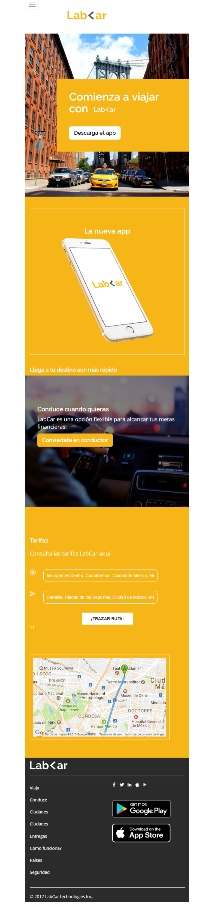

### LabCar ###

------------------------------------------------------

**1.Objetivo(para visualización en dispositivos mayor a 992px):**

En este reto nos indican que debemos replicar una web de forma que se pueda visualizar en pantallas de 992px en adelante de la siguiente forma:

**2.Desarrollo**

2.1. Para esta primera parte realize una estructura simple de un html comoi se veridica la web reconocermos la parte del encabezado que viene a ser el header seguida de cuatro secciones y finalmente el pie de página que es equivalente al footer.

2.2 En la parte del footer se verifica una barra de navegación ingreso el logo y elementos ayudandome con lo ya detallado en la documentación de boostrap.

2.3 Para la primera sección ingreso la imagen por css en la que está sobrepuesa un div, le coloco el color correspondiente le doy un ancho y alto e ingreso la información,el punto a resaltar es que ingreso los botones también con boostrap.

2.4 La segunda sección le doy color dándole tambien ancho y alto luego ingreso la imgane del i phone y el texto correpondiente estos están encerrados en un div que como se observa se le dió un borde de 1px y color blanco.

2.5  Para la tercera sección se ingresa la imagen como se indicó en el punto 2.3 acompañado de un div donde se ingresa la información correspondiente a esa parte utilicé la propiedad opacidad para que quede similar a lo propuesto.

2.6 Para la cuarta sección de igual forma que el punto anterior siobre color,ancho y alto de la sección, se ingresa la información de tarifas y por últimola imagen del mapa encerrada en un div que ya se detalló en el anterior punto.

2.7 Por último tenemos la parte del footer en la que se ingresa el logo,4 listas: la primera y segunda son contextuales a la página web la tercera lista son los las imágenes de app store y google play, y la última lista son los iconos de redes sociales por último está la parte de copyright.

y hemos terminado, el resultado que obtengo es el siguiente:

3)**1.Objetivo(para visualización en dispositivos  de hasta 768px):**

Para la segunda parte nos piden verificar la web en un móvil de la siguiente forma:

**4.Desarrollo**

4.1. Para la sección del header donde se encuentra la barra de navegación se ingresa el menú hamburguesa con la documentación de boostrap de manera que solo sea visible para resolución de hasta 768px.

4.2.Para la primera sección agregué un div e ingresé la inforamción correpondiente más el botón les di color de fondo,la imagen del taxi quedó tal cual luego utilizé una clase de la doc. de boostrap para que sea visible para móviles y y no para pantallas de mayor resolución clase hidden que perimte que se oculte la información de los demás pantallas excepto de la que colocas en este caso ingresé hidden-xs.

4.3 Para la segunda sección solo agregué el texto y también utilicé la clase  visible para el nuevo texto y hidden para que oculte el texto que estaba destinado para web.

4.4 Para la tercera sección la imagen queda tal cual el div como tiene la misma información solo utilicé un offset para poder posicionarlo.

4.5 En la cuarta sección tuve que replicar la sección utilicé hidden y visible para ocultar una y mostar otra y cambié la información para que quede similar a lo que me piden que básicamente son los botones los que tienen otra información y se agrega otra imagen.

4.6 Para culminar la última parte que es el footer solo oculté información de las listas.
