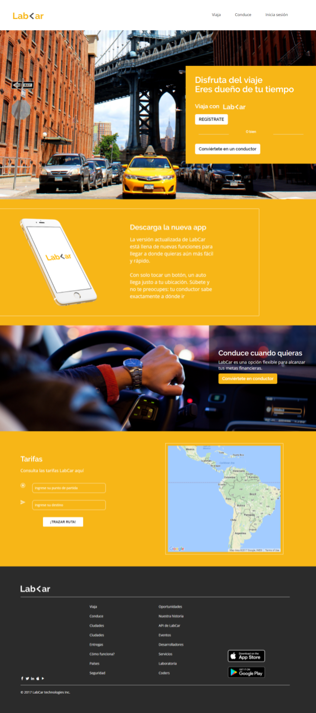
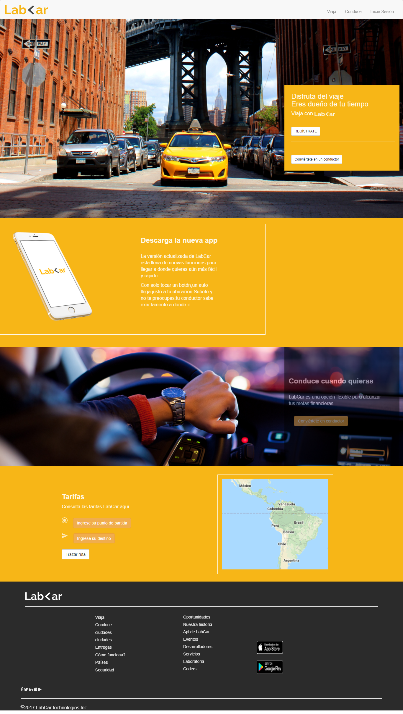

### LabCar###

------------------------------------------------------

**1.Objetivo(para visualización en dispositivos mayor a 992px):**

En este reto nos indican que debemos replicar una web de forma que se pueda visualizar en pantallas de 992px en adelante de la siguiente forma:

**2.Desarrollo**

2.1. Para esta primera parte realize una estructura simple de un html comoi se veridica la web reconocermos la parte del encabezado que viene a ser el header seguida de cuatro secciones y finalmente el pie de página que es equivalente al footer.

2.2 En la parte del footer se verifica una barra de navegación ingreso el logo y elementos ayudandome con lo ya detallado en la documentación de boostrap.

2.3 Para la primera sección ingreso la imagen por css en la que está sobrepuesa un div, le coloco el color correspondiente le doy un ancho y alto e ingreso la información,el punto a resaltar es que ingreso los botones también con boostrap.

2.4 La segunda sección le doy color dándole tambien ancho y alto luego ingreso la imgane del i phone y el texto correpondiente estos están encerrados en un div que como se observa se le dió un borde de 1px y color blanco.

2.5  Para la tercera sección se ingresa la imagen como se indicó en el punto 2.3 acompañado de un div donde se ingresa la información correspondiente a esa parte utilicé la propiedad opacidad para que quede similar a lo propuesto.

2.6 Para la cuarta sección de igual forma que el punto anterior siobre color,ancho y alto de la sección, se ingresa la información de tarifas y por últimola imagen del mapa encerrada en un div que ya se detalló en el anterior punto.

2.7 Por último tenemos la parte del footer en la que se ingresa el logo,4 listas: la primera y segunda son contextuales a la página web la tercera lista son los las imágenes de app store y google play, y la última lista son los iconos de redes sociales por último está la parte de copyright.

y hemos terminado, el resultado que obtengo es el siguiente:

